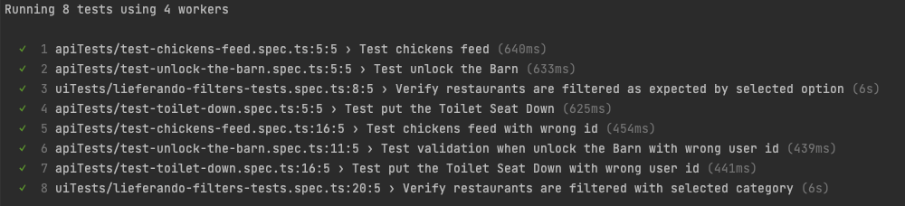
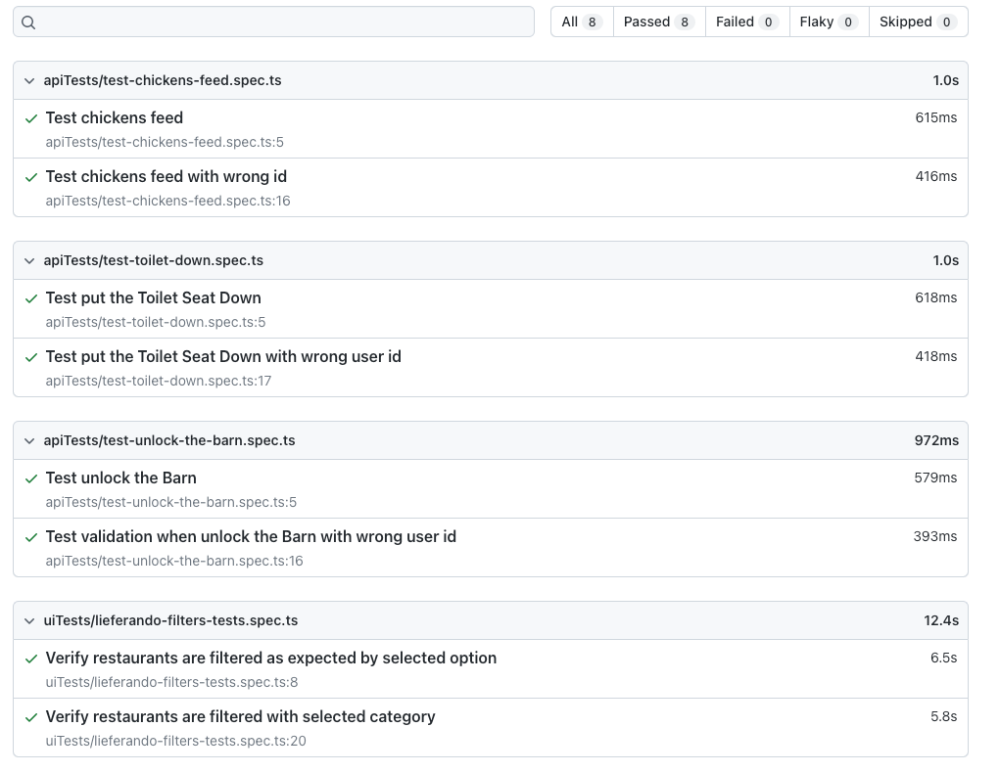

# lieferando_test_task
Test task for Lieferando

[](https://travis-ci.org/joemccann/dillinger)

## Autotests are written using
- Playwright
- TypeScript

## Pre-conditions

Playwright requires [Node.js](https://nodejs.org/) v10+ for launching.

Install Playwright

```sh
npm init playwright@latest
```

## Launching tests
Go to the test directory

* Run ALL the tests with generation HTML report

```sh
npx playwright test --reporter=html  
```

* Run only API tests

```sh
npx playwright test
```

* Run only UI tests

```sh
npx playwright test
```


Result



